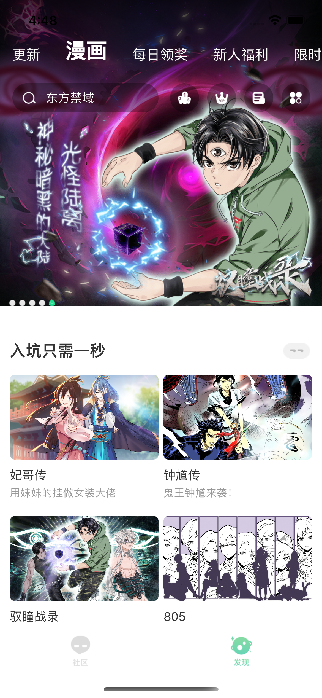

# U17

## 简介

目前iOS开发正逐渐过渡到Swift，所以仿写了有妖气漫画V5.8.3版本其中相对比较复杂的两个页面，数量不在多，毕竟iOS = UITableView + JSON（bushi😂

**Swift和Objective-C混编**，绝大部分是`Swift`。

主要使用：`Moya, Alamofire, SnapKit（漫画列表页）, Kingfisher,  FlexLayout（漫画详情页）, R.swift, CodableWrapper, MJRefresh`等

看完欢迎来个**Star**~

### 截图

**动图**

**漫画列表页**

**漫画详情页**

## 后续计划 

- [ ] 漫画详情页加入Skeleton加载动画

- [ ] 使用IGListKit
- [ ] 使用RxSwift
- [ ] 重构及优化

感谢`huzhiqin` [高仿有妖气漫画APP](https://github.com/huzhiqin/U17)和`spicyShrimp` [旧版仿有妖气漫画APP源代码](https://github.com/spicyShrimp/U17)

**开源仅供学习使用，如有侵权，造成影响，请联系本人删除，谢谢。**

